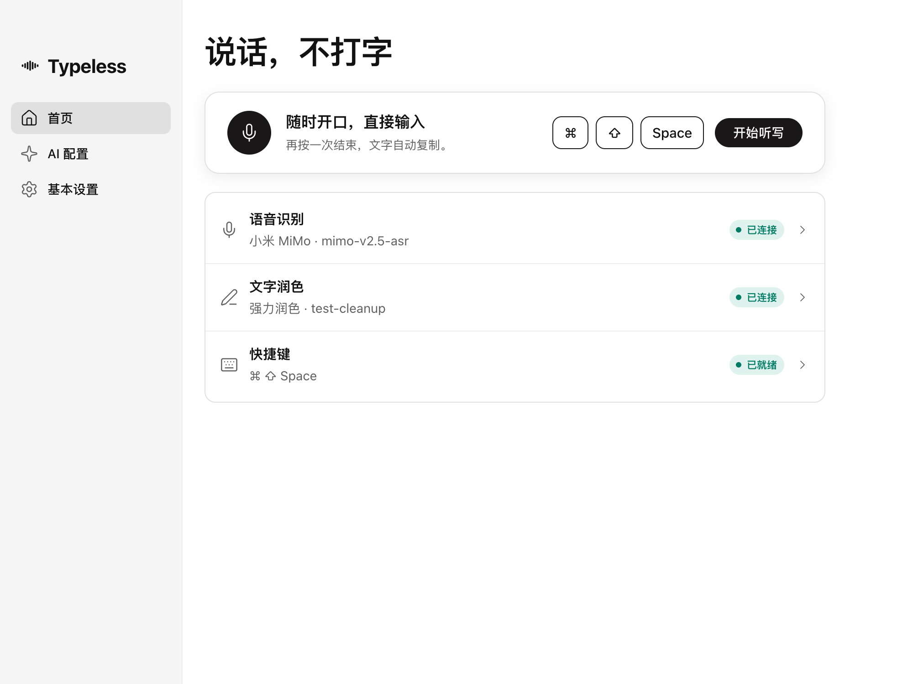

  
  <h1>Typeless</h1>
  
<b>说话，不打字。</b> Desktop dictation for macOS and Windows that runs on your own AI keys.

  

    
    
    
    
  

  
<a href="https://github.com/gaojunbin/Typeless/releases/latest"><b>Download the latest release</b></a>

Tap a shortcut, speak, tap again. Typeless sends the recording to the speech-recognition service you configure, optionally tidies the transcript with a text model, copies the result and can paste it into whatever app is in front. There is no account, no server of ours and no transcript history: your API keys stay on your computer.

## Features

- **One key, anywhere.** Tap Fn on macOS or Right Alt on Windows to start and stop; a fallback chord (Command/Ctrl+Shift+Space) is always available.
- **Your own models.** Speech recognition through Xiaomi MiMo or any OpenAI-compatible endpoint; polishing through any OpenAI-compatible chat model. Keys are encrypted with the operating system's secure storage.
- **Polishing you control.** Choose 不润色, 轻度润色 or 强力润色 and add a free-text 个人表达说明 for names, terms and habits. The prompt asks the model to keep facts, names and numbers, and if polishing fails the raw transcript is still delivered.
- **Copy first, paste optional.** Every result lands on the clipboard; 完成后自动粘贴 sends Command/Ctrl+V to the current app. Typeless never presses Enter.
- **Guided setup.** The first launch walks through permissions, microphone and shortcut, then points you at the AI settings.
- **Built-in updates.** 基本设置 → 关于 checks GitHub Releases and downloads the installer with checksum verification. On macOS one click installs it in place and reopens Typeless; on Windows it opens the archive for you.
- **Chinese or English.** The whole interface is available in both; switch on the welcome screen or under 基本设置 → 通用 → 语言.

The interface defaults to Chinese. Source code and documentation are in English.

## Install

**macOS (Apple silicon, macOS 13 or later).** Download `Typeless-<version>-arm64.dmg`, drag Typeless into Applications and open it. The build is signed with the project's own certificate rather than an Apple one, so macOS warns that the developer cannot be verified; allow the app under 系统设置 → 隐私与安全性. Grant the microphone and 辅助功能 when the setup guide asks.

**Windows (x64, Windows 10 or later).** Download `Typeless-<version>-win.zip`, extract the whole folder and run `Typeless.exe`. The build is unsigned, so SmartScreen may ask you to confirm before it runs.

**Upgrading on macOS.** Releases are sealed with one fixed project certificate, so once you have granted 辅助功能 and 输入监控 to a release from 2.4.0 on, later updates keep those grants and install themselves from 基本设置 → 关于. Coming from 2.3.x or earlier: quit Typeless, remove its entries under 系统设置 → 隐私与安全性 → 辅助功能 and 输入监控, install the new version and grant once more.

## Quick start

1. Finish the setup guide: allow the microphone and 辅助功能, pick an input device and test the shortcut.
2. Open **AI 配置** and connect 语音识别: the Xiaomi MiMo preset is filled in, so paste your key and click 保存. Connect 文字润色 the same way, or choose 不润色.
3. Put the cursor anywhere, tap Fn (Right Alt on Windows), speak, tap again. The text is copied and, if enabled, pasted.

The [user guide](docs/USER_GUIDE.md) covers every setting, the permissions, local storage and troubleshooting.

## Privacy

Audio goes only to the speech provider you configured, and the transcript only to the text model you configured, under their terms. Typeless keeps the current result in memory, stores settings locally, encrypts keys with the system's secure storage and never writes transcripts to disk.

## Documentation

- [User guide](docs/USER_GUIDE.md): settings, permissions, recovery and troubleshooting.
- [Development](docs/DEVELOPMENT.md): build, run, test and package from source.
- Design and evidence: [proposal](docs/PROPOSAL.md), [UI design](docs/UI_DESIGN.md), [validation record](docs/VALIDATION.md).

## Status

Typeless is an independent project and is not affiliated with the commercial Typeless service. macOS builds are sealed with a self-signed project certificate, not an Apple one, and are not notarized; Windows builds are unsigned and have not been run by the maintainer. The [validation record](docs/VALIDATION.md) lists what has actually been checked for the current release.

## License

[MIT](LICENSE)
