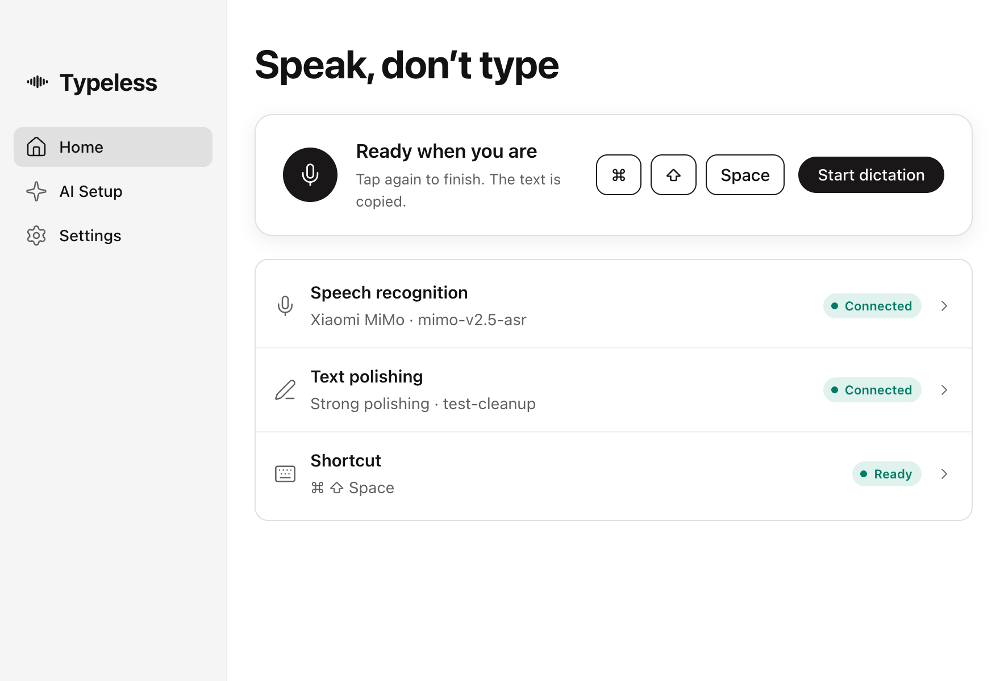

  
  <h1>Typeless</h1>
  
<b>Speak, don't type.</b> Desktop dictation for macOS and Windows that runs on your own AI keys.

  

    
    
    
    
  

  
<a href="https://github.com/gaojunbin/Typeless/releases/latest"><b>Download the latest release</b></a>

Tap a shortcut, speak, tap again. Typeless sends the recording to the speech-recognition service you configure, optionally tidies the transcript with a text model, copies the result and can paste it into the app in front. No account, no server, no transcript history: your API keys stay on your computer.

## Features

- **One key, anywhere.** Tap Fn on macOS or Right Alt on Windows to start and stop. A fallback chord (Command/Ctrl+Shift+Space) is always available.
- **Your own models.** Speech recognition through Xiaomi MiMo or any OpenAI-compatible endpoint; polishing through any OpenAI-compatible chat model. Keys are encrypted with the system's secure storage.
- **Polishing you control.** None, light or strong, plus personal instructions for names and terms. If polishing fails, the raw transcript is still delivered.
- **Copy first, paste optional.** Every result lands on the clipboard; automatic paste sends Command/Ctrl+V to the current app and never presses Enter.
- **Built-in updates.** Settings → About checks GitHub Releases. On macOS one click installs the update in place and reopens Typeless, and permissions survive because every release is sealed with the same project certificate.
- **Chinese or English.** Chinese is the default; switch on the welcome screen or under Settings → General → Language.

## Install

**macOS** (Apple silicon, macOS 13 or later): download `Typeless-<version>-arm64.dmg`, drag Typeless into Applications and open it. The app is signed with the project's own certificate rather than an Apple one, so allow it once under System Settings → Privacy & Security, then grant the microphone and Accessibility when the setup guide asks.

**Windows** (x64, Windows 10 or later): download `Typeless-<version>-win.zip`, extract the whole folder and run `Typeless.exe`. The build is unsigned, so SmartScreen may ask you to confirm.

## Quick start

1. Finish the setup guide: allow the microphone and Accessibility, pick an input device, test the shortcut.
2. Open **AI Setup**, paste your speech-recognition key into the pre-filled Xiaomi MiMo connection and save. Connect a polishing model the same way, or choose no polishing.
3. Put the cursor anywhere, tap the shortcut, speak, tap again. The text is copied and, if enabled, pasted.

## Documentation

- [User guide](docs/USER_GUIDE.md): every setting, permissions, recovery and troubleshooting.
- [Development](docs/DEVELOPMENT.md): build, test and package from source.
- [Proposal](docs/PROPOSAL.md), [UI design](docs/UI_DESIGN.md) and the [validation record](docs/VALIDATION.md) of what has actually been checked.

Typeless is an independent project and is not affiliated with the commercial Typeless service. Windows builds have not been run by the maintainer.

## License

[MIT](LICENSE)
