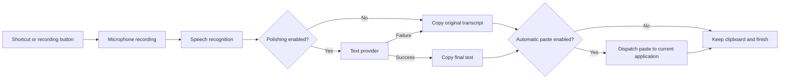

# Typeless: current product scope and implementation plan

Date: 2026-09-18, revised 2026-09-22. Target version: 2.2.1. This document records the reduced product decision. Actual package availability and completed acceptance belong in [Validation](VALIDATION.md), not in this proposal.

## Product direction

Build a small personal AI dictation utility for macOS and Windows: tap, speak, tap again, and receive faithful text on the clipboard with optional paste into the current application. Use a quiet tray/menu-bar presence, a compact non-activating capsule, and one light window that carries both dictation status and configuration. No application account, hosted backend or sync is required.

A new installation opens a first-run setup guide before that shell, so system permissions, the microphone and the shortcut are settled before any provider form is shown; an installation upgraded from an earlier version keeps its existing settings and never sees it. The window is a two-column shell on a white background: a sidebar with three destinations, **首页**, **AI 配置** and **基本设置**, and a content column that renders the selected one. **首页** holds the dictation control, the conditional current result with its recovery actions, and one status list whose three rows (speech recognition, text polishing, shortcut) link to the configuration destinations; getting-started guidance lives only in the setup guide, and no status is repeated across the page. Writing style is part of **AI 配置**, inside the text-polishing form. The two configuration destinations remain one click away with no second navigation layer. The product stays limited to dictation, necessary AI connections, basic preferences and writing style; additional management surfaces are outside this scope. The visual specification for the shell, its pages and the capsule lives in [UI design](UI_DESIGN.md).

The [complete Quickstart review](research/quickstart-review.md), with [dictation/action evidence](research/quickstart-dictation-and-actions.md) and [preferences/recovery evidence](research/quickstart-preferences-and-learning.md), distinguishes published interface evidence from inference. The earlier [settings study](research/settings-simplification.md) covers only that narrower topic. Official screenshots support flat setting rows and direct controls. They do not establish vendor autosave persistence or a three-level polishing selector. Our three-level control and atomic provider form are explicit project decisions.

## Configuration interaction

| Surface | Contents | Save behavior |
| --- | --- | --- |
| Home | Dictation control, current result with its recovery actions, and a three-row status list | No setting is edited here; its cards and buttons navigate to the configuration destinations |
| AI configuration | Independent speech and polishing provider forms, each with endpoint, model, credential, and speech protocol where needed | One explicit Save per provider submits its fields atomically; failed saves retain the draft and show an error |
| Basic settings | Microphone, primary/fallback shortcuts, automatic paste, sounds, login startup, permission status with its recovery controls, the setup guide and a diagnostics copy | Switches/selectors save immediately; text saves on blur or Enter; failures expose retry |
| Writing style | Unchanged transcription, light polishing, strong polishing, optional personal instructions | Level saves immediately; multiline instructions save on blur or Command/Ctrl+Enter |
| First-run setup guide | Welcome, permission cards with live status, microphone test, shortcut test, completion checklist | Requests system permissions and saves only the chosen microphone and the completion flag; leaving or skipping marks setup complete |

No global Save button is needed. Credentials are an intentional exception to immediate saving: address and key changes must not be sent as separate partially edited configurations. Saved keys never echo into the renderer. An empty key field retains its existing value; explicit deletion removes it. An endpoint-origin or ASR-protocol change invalidates the old credential unless a replacement accompanies it.

The shell uses a light sidebar, a near-white content background, grouped setting rows with a left label and a right-aligned control, and pill buttons; [UI design](UI_DESIGN.md) is the authoritative specification for its tokens, components and layout. Errors appear next to the relevant action. Normal completion must not open the main window or turn the capsule into a large status panel. The unconfigured primary action opens AI configuration directly; recoverable setup errors link to the relevant configuration destination. The first-run guide is the only wizard; it is not a second navigation layer over the settings, and basic settings can start it again.

The interface is bilingual. Chinese is the default and the copy the e2e suites select by; English is selectable under **基本设置 → 通用 → 语言** and with the toggle on the setup guide's welcome screen. Every string exists in both languages in one catalogue (`src/renderer/i18n/messages/`), the setting is `general.language`, and the tray menu follows it. No third language is planned.

## Dictation and delivery

macOS uses an isolated Fn tap to start and another to stop. Windows uses isolated Right Alt with chord/AltGr filtering. A configurable Command/Ctrl+Shift+Space fallback and the application recording button remain available when the primary shortcut cannot be used. Universal Windows Fn support is not assumed.

A granted permission that the operating system does not hand to the running process must not become a dead end. A helper holding a listening grant through Accessibility or Input Monitoring cannot repair an event tap that keeps failing, and a replacement helper process does not recover it either, so the permission card and the shortcut status present that combination as a stale grant: they name the cause, offer a full application relaunch as the first step, a link to the relevant system pane, and a one-click diagnostics copy for a bug report. Local builds are ad-hoc signed and take a new identity with every release, so a permission still reported as pending after the relaunch has to be removed and added again in system settings. A relaunch is a recovery attempt, not a guarantee that the system will supply a working tap. While the setup guide is open, a shortcut press only proves that the event arrived and must not start a dictation session.

Recording starts anywhere without capturing an original target or classifying the foreground application. No Accessibility-tree lookup, editable-field requirement or terminal gate precedes the microphone. The capsule is a black bar that shows a waveform only after capture starts and a **思考中** label during processing. Its cancel and finish controls are always visible while recording, and cancel stays available during processing; the remaining time appears inside the capsule for the last ten seconds of the recording cap. It is non-activating and hides after copying and the optional paste attempt. Clicking an error capsule explicitly opens recovery. These controls must preserve the foreground editor during ordinary recording and completion.

Every completed result replaces the clipboard and stays there. Automatic paste dispatches Command+V/Ctrl+V to the current foreground application, without focus restoration or an original-target lock. It never presses Enter. If there is no usable input or paste is unavailable, copied text remains available for manual use. Dispatched and confirmed delivery must remain distinct; a shortcut event is not proof that an editor accepted text.

Cancellation aborts capture and provider work, fences late results, and prevents superseded jobs from overwriting a newer clipboard result. It cannot undo a copy or paste already completed. An uncertain paste is never automatically dispatched twice. Clipboard-copy failures are separate errors; polishing failure instead preserves the original transcript, copies it, and leaves a warning.

The recorder produces mono 16 kHz PCM16 WAV with a 60-second default cap. Silence alone does not terminate a thinking pause. Recognition failures can retain only the active audio in memory for bounded retry; success, cancellation, another session or quitting releases it.

## Providers and writing behavior

MiMo uses the default base `https://api.xiaomimimo.com/v1`, model `mimo-v2.5-asr`, and a user-provided key. Its adapter sends Base64 audio in a `/chat/completions` message. The independent OpenAI-compatible ASR adapter uses multipart `/audio/transcriptions`. Exact provider contracts and sources belong in the [provider study](research/providers.md). No provider change silently substitutes another service.

The text connection has its own URL, model and key. The user-facing levels are:

- Unchanged transcription: no text-model request.
- Light polishing: remove clear fillers and accidental repetitions while preserving phrasing.
- Strong polishing: also resolve explicit self-corrections and remove redundant scaffolding, preserving facts, entities, identifiers, quantities, negation and uncertainty.

Strong is the new-install default. Personal instructions influence expression without turning dictated content into executable model instructions. An unresolved name stays unresolved; a cleanup model must not invent it. Malformed, refused, truncated or empty model responses are failures, not successful polished text. Original recognition remains available when cleanup fails. The current session exposes original and edited views; copying either is clipboard-only, never another model request or paste. A new session resets its view and copy feedback. Personal instructions remain saved but inactive when polishing is disabled.

Prompts and mock HTTP fixtures can establish requested behavior and request contracts; they cannot establish real output quality. Any quality claim requires separately authorized live-provider evaluation on representative speech, including Chinese/English mixing, negation, numbers, quoted fillers and self-corrections.

## Architecture and local data

Use Electron, React and TypeScript for shared interface and logic, Swift for macOS native events, and a Windows C# helper for keyboard hooks and paste dispatch. The renderer has no Node integration or direct key access. A narrow preload bridge validates actions and IPC senders. The main process owns network requests, credentials, lifecycle, clipboard and paste decisions. Session IDs and cancellation signals fence old audio, late responses and duplicate completion.

Recent helper status transitions are kept in memory and appended to a bounded local log, and the diagnostics report assembled from them carries versions, code-signing identity, non-secret settings and permissions only. One local settings store owns active configuration and encrypted credentials. Keys use OS-protected encryption before persistence; plaintext fallback is prohibited. Settings other than credentials are not encrypted by this application. The current result is transient and is not written as a transcript archive. Audio is memory-only, including the bounded recognition retry window.

Audio goes to the chosen speech provider; enabled polishing sends the transcript and personal writing instructions to the chosen text provider. The pipeline does not gather screenshots, arbitrary documents, application-specific context or continuous typing. No provider-wide zero-retention or offline claim follows from local credential storage. Production code leaves the new clipboard text in place rather than restoring prior content.

The [implementation decision](IMPLEMENTATION_DECISION.md) explains the Electron/native tradeoff. Older broad research remains evidence of investigated options, not a current feature checklist.

## Acceptance and distribution

Implementation and validation are separate. Required checks include:

1. Three sidebar destinations: **首页** plus exactly two configuration destinations, with writing style inside **AI 配置**; no extra navigation step to reach their core controls.
2. Immediate level/select/switch saving, text-field commit behavior, failure feedback and restart persistence.
3. Independent atomic provider saves, retained drafts on failure, no echoed keys, credential-origin binding and no plaintext persistence.
4. Real capture framing, correct provider routes, unchanged-transcript mode with no cleanup request, and raw fallback on cleanup failure.
5. Cancellation and late-response fencing, duplicate-stop protection, serialized clipboard ownership and no repeated uncertain paste.
6. Recording with no input field; external editor input events, retained clipboard, no Enter, no focus theft and correct capsule lifecycle.
7. Primary/fallback shortcut status independently reported; native unavailable, permission-denied and authorized-but-not-listening cases remain actionable, the last through its relaunch, system-settings and diagnostics controls.
8. Always-visible capsule cancel/finish and click-to-recover, specific error routes, clipboard-only original/result copying, and new-session isolation. External-editor tests must establish that using the capsule controls does not steal the paste destination.
9. First run enters the setup guide, each permission state is actionable, the microphone test and counted shortcut presses start no session, completing or skipping is persistent, an upgraded settings file skips the guide, and basic settings can start it again.

Unit and mock-provider Electron tests exercise contracts and application behavior. Native editor tests, physical shortcut tests, real microphones, live providers, Windows runtime and packaged installation are separate acceptance boundaries. Test scripts and proposed checks must not be reported as completed results until executed.

Version 2.2.1 packaging targets macOS Apple silicon DMG and Windows x64 portable ZIP. Package builds do not imply signing, notarization, publication or platform-runtime acceptance. The application checks GitHub Releases for a newer version and downloads its installer on request, verifying the published digest; it never replaces itself, because ad-hoc signed builds must be reinstalled and re-authorized by hand. The [development guide](DEVELOPMENT.md) supplies commands and output paths; [Validation](VALIDATION.md) records the evidence.

Provider cost is the chosen ASR usage plus the selected text model's input/output usage when polishing is enabled. No fixed price or latency is promised. Direct provider access requires no application-hosting backend.
