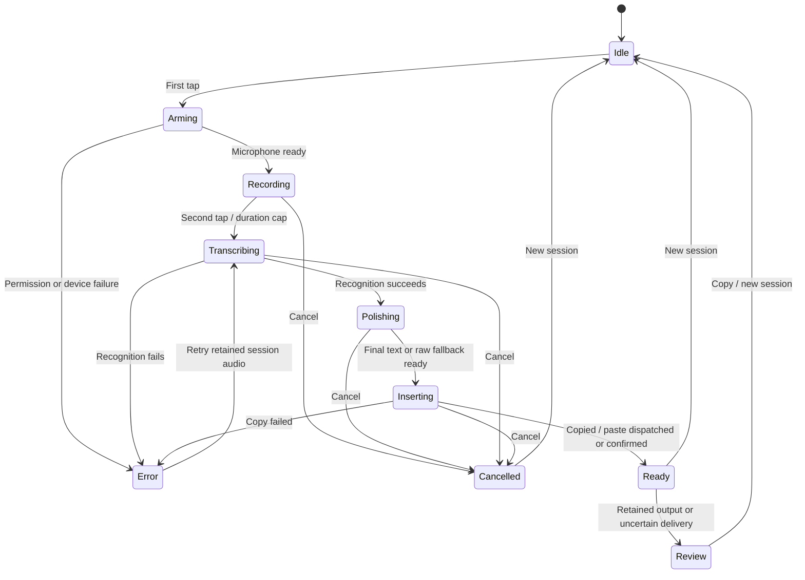
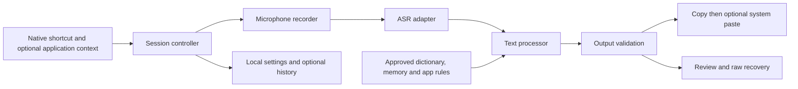

# Typeless: product proposal and implementation plan

Date: 2026-09-17. Decision: build the first usable macOS and Windows release together. Implementation was authorized after the initial research request. This document describes the intended product; actual completion and verification belong in [VALIDATION.md](VALIDATION.md).

## Product direction

Create a personal, bring-your-own-key dictation application: one tap starts recording, another finishes, and AI turns speech into faithful, readable text on the clipboard, with an optional paste into the current application. The product should feel like a small native writing utility: a quiet menu-bar/tray presence, a compact recording overlay, and a clear light settings window. No account or hosted backend is required.

The key improvement over opaque personalization is user control. Vocabulary, memories and application writing rules are visible and editable. Raw transcripts remain recoverable if cleanup fails. Provider destinations and configuration are explicit.

The public Typeless guide documents the same toggle interaction, with Fn on macOS and Right Alt on Windows. Its broader offering includes cleanup, language handling, dictionary learning, personalization, translation and selected-text assistance. These are vendor-documented capabilities, not features we personally benchmarked. See the [product study](research/typeless-product.md) for the feature matrix, independent experience reports, source links and uncertainty ledger.

## Scope and fidelity

| Area | First usable release on both desktops | Later enhancement |
|---|---|---|
| Dictation | Start/stop toggle, device choice, waveform, main-window timer, cancellation, finite duration, silence detection | Push-to-talk, longer chunked sessions, additional microphone modes |
| Recognition | MiMo preset and independent OpenAI-compatible transcription adapter | Further vendor adapters and genuinely streaming audio backends |
| Text | Conservative cleanup, raw recovery, explicit translation, custom writing preferences | Selection-bound voice editing with reversible replacement |
| Personalization | User dictionary, explicit scoped memory, application profiles, correction-based opt-in memory | Reviewed automatic suggestions and richer style learning |
| Integration | Global shortcut, automatic retained copy, optional current-application paste | Expanded editor compatibility and full transactional undo |
| Local data | Optional history, expiry, text export, delete, no stored raw audio after session lifecycle | Optional encrypted cross-device sync |
| Distribution | macOS Apple silicon build and Windows x64 implementation/package | Intel Mac and Windows ARM qualification, signed automatic updates |

General web assistance, mobile keyboards, team administration and account billing are outside this first release. A registered OS IME is unnecessary for the requested workflow; the application cooperates with existing input methods.

## Shortcut and recording experience

The macOS default is **one isolated Fn tap to start, then one isolated Fn tap to stop**. Releasing the first tap does not finish dictation. Fn combinations must not accidentally trigger recording. A conventional configurable shortcut provides a fallback when native permissions or hardware events are unavailable.

On Windows, most Fn keys are handled below the application-visible keyboard layer. Microsoft explicitly documents that Fn usually cannot be remapped. The usable default is Right Alt, with chord/AltGr filtering and an alternative configurable combination. Universal Windows Fn support is not an achievable software-only acceptance requirement. Sources: [Microsoft Keyboard Manager](https://learn.microsoft.com/en-us/windows/powertoys/keyboard-manager) and [Typeless Dictate](https://www.typeless.com/help/quickstart/dictate), accessed 2026-09-17.

Recording can begin anywhere without an input-field eligibility check. Application context is best effort and does not gate recording. The normal non-activating capsule shows only a live waveform during recording and a loading animation during recognition, cleanup and delivery. It hides after successful copying and the optional paste attempt, including when no input field is focused. Timers and recovery details belong in the main window; brief recovery notices do not open that window automatically. Right-click exposes cancellation without permanent overlay controls. Practice stays in the main window and automatically copies without pasting. Silence does not automatically end a thinking pause; the configured duration cap still applies. Cancellation stops capture, aborts requests and fences pending native dispatch; it cannot undo an input event already delivered.

The application never presses Enter or clicks Send. It always copies final text, then optionally dispatches the platform paste shortcut to the current foreground application. There is no original-target lock or forced focus restoration. With no input field or unavailable paste permission, copied text remains available for manual paste; receiving-application behavior is not inferred from shortcut dispatch.

## Architecture

Use Electron + React + TypeScript for the shared application and business logic. A Swift helper handles macOS events/accessibility. A Windows C# helper handles keyboard hooks and current-application paste dispatch. The [implementation decision](IMPLEMENTATION_DECISION.md) records why this replaced the research's initial Tauri preference and its runtime-size tradeoff. The [desktop architecture study](research/desktop-architecture.md) contains the detailed API evidence, platform constraints and acceptance matrix.

The renderer has no Node integration and no direct access to keys. A narrow preload bridge validates messages and IPC senders. Only the local application can request microphone permission. Session IDs prevent stale audio, duplicated stops and late model responses from changing the current session. The main process owns network requests, encrypted credentials, cancellation, history and insertion decisions.

The main process writes final text to the clipboard and leaves it there. Practice, manual mode, text-only processing and raw fallback all follow this copy-first rule. Automatic paste uses the system shortcut for the current foreground application; it does not validate an original field or require AX editor inspection. Pending operations retain cancellation and deadline checks. Paste failure does not turn successful copying into a failed dictation. A dispatched OS event is not proof of visible input, and previous clipboard content is not restored by production code.

## Provider design

MiMo defaults to `https://api.xiaomimimo.com/v1`, model `mimo-v2.5-asr`, with a user-entered key. Its documented ASR request is `POST /chat/completions` containing a Base64 `input_audio` message. It accepts WAV/MP3 with a 10 MB encoded-audio limit. It is not the standard OpenAI multipart transcription route. The separate OpenAI-compatible ASR adapter uses `/audio/transcriptions`. See the exact source-linked contracts and examples in the [provider study](research/providers.md).

The initial recorder produces mono PCM WAV, with a conservative visible application duration cap. The chosen sample rate and cap are application decisions, not undocumented MiMo guarantees. The encoded-size limit is checked before network submission. A text SSE response is not proof of real-time audio-input support.

Cleanup has an independent base URL, key and model, with one visible selector for no polishing, light polishing or strong polishing. No polishing returns the original transcript without a text-model request. Light polishing removes clear fillers and accidental repetitions with minimal rephrasing. Strong polishing also resolves explicit self-corrections and removes redundant scaffolding, while preserving facts, names, identifiers, quantities, negation and uncertainty. The existing persisted enable/strength fields express these choices without replacing saved configuration. New installations default to strong polishing. Translation is an explicit mode with a selected target language and remains available when ordinary polishing is off. Dictated questions remain text to write, not requests for the model to execute.

Model errors, refusal, truncation, malformed responses and empty output never count as successful final text. Successful ASR remains available if cleanup fails. Recognition errors retain only bounded in-memory retry audio for the active failed session. Cancellation and starting another session release it. Provider changes never silently send audio to a fallback vendor.

A base-URL origin change invalidates the associated saved key unless the user explicitly supplies a replacement. Cross-origin redirects do not forward authorization. A model-list connection check is labeled as such; it does not claim to validate transcription or model access. Request cancellation cannot guarantee that the remote provider avoided billing.

## Memory and local data

| Data | Purpose | Control |
|---|---|---|
| Dictionary | Canonical names, terms and explicit replacement hints in cleanup | Add/edit/delete, scope, CSV import/export; the first MiMo adapter has no verified ASR hotword parameter |
| Writing preferences | Global cleanup strength and instructions | Editable settings, reset by user |
| App profile | Style rules for a selected application | Explicit app name, enable switch, delete |
| Memory | User-approved recurring writing facts or preferences | Visible content, provenance, scope, enable and delete |
| Correction memory | A user-selected lesson from editing a history entry | Explicit remember action; no background keystroke monitoring |
| History | Review raw/final text and reprocess text | Opt-in storage, retention days, delete/export |
| Audio | Current recognition job and immediate failure recovery | Memory only; no raw-audio history or cloud sync |

One local settings store owns configuration and optional text history. API keys are encrypted with OS-protected storage before persistence; they are never echoed into UI snapshots or exported history. If encryption is unavailable, plaintext persistence is not an acceptable fallback. Deleting a memory removes it from future prompts, including when history is independently retained.

BYOK still sends audio to the selected ASR provider and text plus approved personalization to the cleanup provider. Application context is an explicit option. The baseline does not read screenshots, arbitrary documents, existing clipboard contents for model context, or continuous typing. External data retention follows each configured provider's terms; the application cannot promise provider-wide zero retention. No analytics or hosted sync is required.

## Screens and first run

The home screen concentrates on recording, readiness, the current result and recovery. History, Dictionary, Memory, App Profiles and Settings have separate navigation. Settings expose the two provider configurations, microphone device, shortcut, output language, translation target, writing instructions, history retention, context permissions and startup behavior.

First run explains the audio/text destinations, collects the user's keys and endpoints, checks permissions on explicit action, then lets the user verify microphone and shortcut behavior by practicing inside the app. This is guided settings plus a practice flow, not a separate automatic hardware test suite. Missing keys are visible and do not masquerade as a ready cloud transcription service. The interface defaults to Chinese for this user, with a light, restrained appearance and accessible labels, focus and keyboard controls.

## Validation, milestones and operating cost

Implementation proceeds through four dependent gates: shared contracts and native feasibility; real recording/provider/data workflows; full UI and cross-platform integration; packaging and acceptance evidence. Native system tests, real-provider tests, unit tests, UI checks and signed distribution are separate gates. Both desktop implementations advance in each phase; Windows is not a later product launch.

Required tests cover toggles and chords, microphone failures, WAV correctness, MiMo payload and encoded-size checks, independent transcription formats, malformed/refused outputs, credential-origin binding, cancellation, current-application paste, retained clipboard output, recording without an input field, dictionary/memory CRUD, history retention, and restart persistence. Controlled mock-provider integration verifies the application pipeline without pretending to measure live model quality.

Performance goals are responsive recording feedback and a clearly identified ASR/cleanup state while waiting. Any latency number must be measured with network, audio length, selected model and hardware recorded. No numerical service latency or recognition accuracy is promised before actual keyed tests. The first benchmark set should include Chinese/English mixing, negation, dates/amounts, quoted fillers, self-correction, lists and technical identifiers.

The provider study records MiMo's publicly listed ASR price as CNY 0.5 per hour of audio on the research date; verify the account's actual billing terms before budgeting. Estimated usage cost equals audio hours multiplied by the selected ASR rate, plus cleanup input/output tokens multiplied by that provider's rates. Text model cost cannot be fixed before the user selects a provider and model. Direct desktop-to-provider access requires no application server hosting cost.

## Requirement traceability

| User requirement | Component | Acceptance |
|---|---|---|
| All work in `Typeless` | Project structure and local build caches | Source, research, build outputs and evidence reside inside this directory |
| Research Typeless and produce a complete plan | Three evidence reports plus this proposal | Source-linked feature matrix, UX, platform/provider constraints and decisions |
| MiMo ASR, user-configured key, official default | MiMo adapter and settings | Correct request fixture; real key-based acceptance explicitly separate |
| Other recognition vendors | Independent provider interface and OpenAI adapter | Switching routes/payloads without coupling cleanup configuration |
| OpenAI-compatible polishing | Text processor | User URL/key/model; raw fallback; preservation fixtures |
| Fn start/stop | Native shortcuts and shared state machine | Two isolated taps on macOS; documented usable Windows alternative |
| Memory and personalization | Dictionary, memory, profiles and correction flow | Inspect/edit/delete/disable and verify next request context |
| macOS and Windows together | Shared app plus two native helpers | Both platform sources/packages and separate native acceptance evidence |
| Proceed autonomously to a complete first implementation | Coordinated implementation and validation | Runnable artifact, instructions, real results and explicit remaining limitations |

The final delivery index is [README.md](../README.md). Current implementation and test results are documented in [VALIDATION.md](VALIDATION.md); this proposal alone does not assert that any acceptance gate passed.
